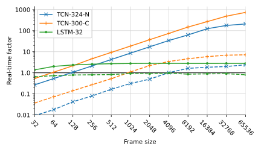

<div  align="center">

# micro-TCN

Efficient neural networks for audio effect modeling.

| [Paper](https://arxiv.org/abs/2102.06200) | [Demo](https://csteinmetz1.github.io/tcn-audio-effects/) | [Plugin](https://drive.google.com/drive/folders/1Yq0jAZ5WIXolMuEUH11OgUCzpmtA5g37?usp=sharing) |

</div>

<div align="center">

</div>

## Setup

Install the requirements.
```
python3 -m venv env/
source env/bin/activate
pip install -r requirements.txt
```

Then install auraloss.
```
pip install git+https://github.com/csteinmetz1/auraloss
```

## Pre-trained models

You can download the pre-trained models [here](https://drive.google.com/file/d/1FkTZFn_6UFTX2ozB9G2RoONXQcuhJ0CX/view?usp=sharing). Then unzip as below.
```
mkdir lightning_logs
mv models.zip lightning_logs/
cd lightning_logs/
unzip models.zip 
```

Use the `compy.py` script in order to process audio files. 
Below is an example of how to run the TCN-300-C pre-trained model on GPU.
This will process all the files in the `audio/` directory with the limit mode engaged and a peak reduction of 42. 

```
python comp.py -i audio/ --limit 1 --peak_red 42 --gpu
```

If you want to hear the output of a different model, you can pass the ``--model_id`` flag. 
To view the available pre-trained models (once you have downloaded them) run the following.

```
python comp.py --list_models

Found 13 models in ./lightning_logs/bulk
1-uTCN-300__causal__4-10-13__fraction-0.01-bs32
10-LSTM-32__1-32__fraction-1.0-bs32
11-uTCN-300__causal__3-60-5__fraction-1.0-bs32
13-uTCN-300__noncausal__30-2-15__fraction-1.0-bs32
14-uTCN-324-16__noncausal__10-2-15__fraction-1.0-bs32
2-uTCN-100__causal__4-10-5__fraction-1.0-bs32
3-uTCN-300__causal__4-10-13__fraction-1.0-bs32
4-uTCN-1000__causal__5-10-5__fraction-1.0-bs32
5-uTCN-100__noncausal__4-10-5__fraction-1.0-bs32
6-uTCN-300__noncausal__4-10-13__fraction-1.0-bs32
7-uTCN-1000__noncausal__5-10-5__fraction-1.0-bs32
8-TCN-300__noncausal__10-2-15__fraction-1.0-bs32
9-uTCN-300__causal__4-10-13__fraction-0.1-bs32
```

We also provide versions of the pre-trained models that have been converted to TorchScript for use in C++ [here]().

## Evaluation

You will first need to download the [SignalTrain dataset](https://zenodo.org/record/3824876) (~20GB) as well as the pre-trained models above.
With this, you can then run the same evaluation pipeline used for reporting the metrics in the paper. 
If you would like to do this on GPU, perform the following command. 

```
python test.py \
--root_dir /path/to/SignalTrain_LA2A_Dataset_1.1 \
--half \
--preload \
--eval_subset test \
--save_dir test_audio \
```

In this case, not only will the metrics be printed to terminal, we will also save out all of the processed audio from the test set to disk in the `test_audio/` directory.
If you would like to run the tests across the entire dataset you can specific a different string after the `--eval_subset` flag, as either `train`, `val`, or `full`.

## Training

If would like to re-train the models in the paper, you can run the training script which will train all the models one by one. 

```
python train.py \ 
--root_dir /path/to/SignalTrain_LA2A_Dataset_1.1 \
--precision 16 \
--preload \
--gpus 1 \
```

## Plugin

We provide plugin builds (AV/VST3) for [macOS](https://drive.google.com/drive/folders/1Yq0jAZ5WIXolMuEUH11OgUCzpmtA5g37?usp=sharing). 
You can also build the plugin for your platform.
This will require the traced models, which you can download [here](https://drive.google.com/file/d/1FkkVl_EyU9Ztxi--AFVXJyd2uWYx3nqm/view?usp=sharing).
First, you will need download and extract libtorch. 
Check the [PyTorch site](https://pytorch.org/get-started/locally/) to find the correct version. 

```
wget https://download.pytorch.org/libtorch/cpu/libtorch-macos-1.7.1.zip
unzip libtorch-macos-1.7.1.zip
```

Now move this into the `realtime/` directory .
```
mv libtorch realtime/
```

We provide a `ncomp.jucer` file and a `CMakeLists.txt` that was created using [FRUT](https://github.com/McMartin/FRUT).
You will likely need to compile and run FRUT on this `.jucer` file in order to create a valid `CMakeLists.txt`.
To do so, follow the instructions on compiling [FRUT](https://github.com/McMartin/FRUT).
Then convert the `.jucer` file. You will have to update the paths here to reflect the location of FRUT.
```
cd realtime/plugin/
../../FRUT/prefix/FRUT/bin/Jucer2CMake reprojucer ncomp.jucer ../../FRUT/prefix/FRUT/cmake/Reprojucer.cmake
```

Now you can finally build the plugin using CMake with the `build.sh` script. 
BUT, you will have to first update the path to libtorch in the `build.sh` script.
```
rm -rf build
mkdir build
cd build
cmake .. -G Xcode -DCMAKE_PREFIX_PATH=/absolute/path/to/libtorch ..
cmake --build .
```

## Citation
If you use any of this code in your work, please consider citing us. 
```    
    @article{steinmetz2021efficient,
            title={Efficient Neural Networks for Real-time Analog Audio Effect Modeling},
            author={Steinmetz, Christian J. and Reiss, Joshua D.},
            journal={arXiv:2102.06200},
            year={2021}}
```
